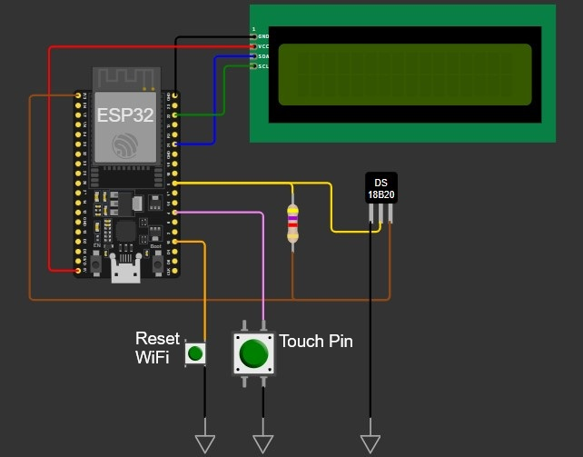
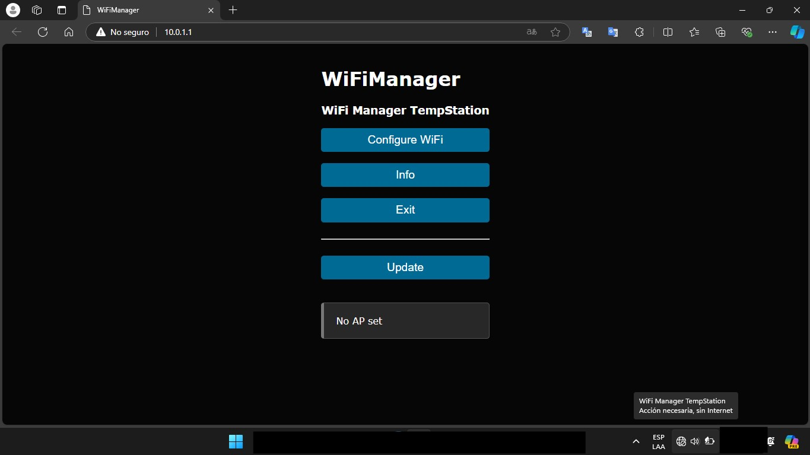
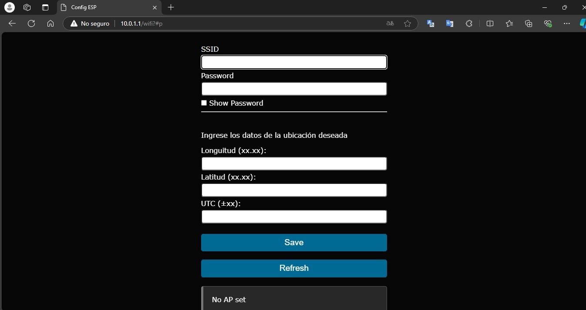

# "TimeStation: Clock + Thermometer + AI"

## 📋 INTRODUCTION

The TempStation project is about creating a device capable of displaying on a screen the date and time, the temperature measured in a room, the outside temperature in a given location and a related phrase generated with AI.

The user will be able to initially configure the device through a web interface, where they will enter the credentials to connect to a WiFi network, the coordinates where they want to obtain the outside temperature and their time zone.

The information presented on the screen can be scrolled through using a touch command.

## ⚙️ HARDWARE

I used an ESP32 microcontroller DEVKIT version programmed in Arduino IDE (C++), a DS18B20 temperature sensor and a 16x2 LCD display with I2C communication.

### Wiring🔌
| GPIO | Name | Purpose |
| :----- | :-----|:-----|
| GPIO 21 | LCD SDA | I2C to Display Communication |
| GPIO22 | LCD SCL | I2C to Display Communication |
| GPIO5 | SensorPin | DS18B20 data pin |
| GPIO4 | touchPin | Screen scroll control |
| GPIO2 | touchLED | Touch indicator LED |
| GPIO15 | RstWF | Reset WiFi settings |



### Enclosure💡

The final product was conceived as a digital wall clock that can be hung and displayed for user use, but can also be designed as a desktop or portable device.

The casing has not yet been designed.

## 📀 FIRMWARE

### WiFi Manager + Custom Parameters🛜


I used the library [WiFiManager by tzapu](https://github.com/tzapu/WiFiManager). To know how to implement it I recommend seeing the examples in the repository.

When the device starts up for the first time (or the settings are reset), a local WiFi access point is created where we can connect and, through a web interface, choose the WiFi network we want to connect to, entering its password there to save it in the device's memory. Thus, on subsequent power-ups, it will automatically connect to the configured network without having to go through the process again. In addition, I use the library's ability to add custom parameters to this interface, to request location data from the user that will be used to obtain date, time and weather.

The user interface looks like this:



After entering the "Configure WiFi" option, it requests the location data, configured as follows:

```c++
void CustomWiFiManager(){
  // [...]
  WiFiManagerParameter custom_text("<p>Enter the data of the desired location</p>"); // HTML text at the bottom
  wifiManager.addParameter(&custom_text);

  // Create form in WM
  WiFiManagerParameter custom_param1("param1", "Longuitud (xx.xx):", 0, 6); // ID, label, default value, legth
  WiFiManagerParameter custom_param2("param2", "Latitud (xx.xx):", 0, 6);
  WiFiManagerParameter custom_param3("param3", "UTC (±xx):", 0, 3);
 
  // Get parameters entered in WM
  wifiManager.addParameter(&custom_param1);
  wifiManager.addParameter(&custom_param2);
  wifiManager.addParameter(&custom_param3);
  // [...]
}
```



Longitude, Latitude and UTC data will be stored in EEPROM at addresses `address_lat`, `address_lon` and `address_utc`.

```c++
void CustomWiFiManager(){
  // [...]
  // Save WM parameters in global variables
  String parameter1 = custom_param1.getValue();
  String parameter2 = custom_param2.getValue();
  String parameter3 = custom_param3.getValue();

  // Convert data
  lat = parameter1.toFloat();
  lon = parameter2.toFloat();
  utc = parameter3.toInt();

  // Save data to EEPROM if flag is true
  if (shouldSaveConfig) {
    EEPROM.put(address_lat, lat);
    EEPROM.put(address_lon, lon);
    EEPROM.put(address_utc, utc);
    EEPROM.commit();
  }
  // [...]
}
```
 They will be consulted by the code to establish the location.

```c++
void setup(){
  // [...]
  // Search saved data
  EEPROM.get(address_lat, lat);
  EEPROM.get(address_lon, lon);
  EEPROM.get(address_utc, utc);
  // [...]
}
  ```
To ensure that the data entered by the user remains stored in the microcontroller's memory after it is reset, it is necessary to implement a flag in the function that is raised if the data has been updated to save it and remains low if the data has not changed, so as not to overwrite it with the default value.

```c++
bool shouldSaveConfig = false; // Flag to save data

void saveConfigCallback() {
  // Flag true if WM data was updated
  shouldSaveConfig = true;
}

void CustomWiFiManager(){
  // [...]
  wifiManager.setSaveConfigCallback(saveConfigCallback); // Call the function if data was updated
  // [...]
  }
```

Finally, the `RstWF` push button is available to reset the WiFi settings and start the WiFi Manager process again. This allows the device to be relocated to another network or geographic location.

```c++
void loop(){
  // [...]
  //RESET WIFI
  if(digitalRead(RstWF) == LOW){
    delay(50);
      if(digitalRead(RstWF) == LOW){
        wifiManager.resetSettings();
        Serial.println("--- WIFI SETTINGS ERASED ---");
        lcd.clear();
        lcd.backlight();
        lcd.setCursor(2, 0);
        lcd.print("WiFi RESET...");
        delay(1500);
        lcd.clear();
        ESP.restart();
      }
  }
  // [...]
}
```

### Date & Time (NTP server)🕒

I used the `Time.h` library to get the date and time based on the time zone specified by the user.
In the `setup()` you need to do the initial configuration and then call the `TimeData()` function to apply it.

```c++
void setup(){
 // [...]
 // Date and Time config
  configTime(utc*60*60, 0, "pool.ntp.org"); // UTC in seconds
  TimeData();
 // [...]
}
```

The `TimeData()` function queries the server for the day, month, and year and saves the data in the `time[]` structure.

```c++
// Get Date and Time from NTP Server
String TimeData() {
 struct tm timeinfo;
  if(!getLocalTime(&timeinfo)){
    Serial.println("Failed to obtain time");
  }
  char time[20];
  strftime(time, sizeof(time), "%d/%m/%y   %H:%M", &timeinfo);
  
  return time;
}
```

This function will be queried from the `loop()` every 1 minute, according to the predefined interval `NtpInterval`.

### Ambient temperature measurement🏠

The `OneWire.h` library provides basic bit-level communication with the sensor, while `DallasTemperature.h` handles DS18B20-specific commands and converting the data into readable temperature.

Using both libraries together, objects of the corresponding classes are created to handle communication with the sensor.

```c++
void loop(){
 // [...]
// Ask Sensor and API’s
  if (millis() - WTPrevMillis > WTInterval || WTPrevMillis == 0){

  // Measure indoor temperature
  sensors.requestTemperatures();
  localTemp = sensors.getTempCByIndex(0); // Ask sensor #0   
      Serial.print("Local Temp: ");      
      Serial.println(localTemp);
  // [...]
 }
// [...]
}
```

The function to get the temperature will be queried at a predefined 30 minute interval called `WTInterval`.

### OpenWeatherMap API🌅

To query the API, you must first create an account on [OpenWeatherMap](https://openweathermap.org/api) and obtain the ApiKey. Free accounts are sufficient for this project.

The libraries `HTTPClient.h` are used to perform the query and `ArduinoJson.h` to condition the data obtained.

The URL to be consulted is composed of the data previously requested from the user (Longitude, Latitude and UTC), the ApiKey, the language and the preferred metric system.

```c++
void getWeatherData(){
  // [...]
  // URL web
  String url = "https://api.openweathermap.org/data/2.5/weather?lat=" + String(lat) + "&lon=" + String(lon) + "&appid=" + apiKey + "&units=metric&lang=es";

  // URL query
  http.begin(url);
  int httpCode = http.GET();

  if(httpCode > 0) {
    String payload = http.getString();
    // JSON Parse
      StaticJsonDocument<1024> doc;
      DeserializationError error = deserializeJson(doc, payload);
  // [...]
  // Get current temperature in JSON
  Temp = doc["main"]["temp"];
  // Get thermal sensation in JSON
  feelTemp = doc["main"]["feels_like"];
  // [...]
  }
// [...]
}
```
After querying, the data is extracted using the `deserializeJson()` function, in our case, the temperature in `Temp` and the thermal sensation in `feels_like` to show them on the display.

This function will be consulted according to the `WTInterval` interval.

### Gemini AI API🤖✨

To consult this API, we will need to register in [Google AI Studio](https://aistudio.google.com/app/apikey) and generate an apikey.

In our `prompt` we will indicate the current temperature that we consulted in OpenWeatherMap and we will ask the AI ​​to recommend which clothes are best for going out.

After several tests, the best results were obtained with the following `prompt`:

```c++
"It's XX °C outside. How should I dress to go out if I'm a bit cold? Answer in 30 characters maximum, using Argentine slang, without using accented characters or commas."
```

Then, in our function called `Gemini()` we build the API query indicating the `prompt` and the maximum number of tokens to process, defined as a constant in our code. After receiving the response in JSON format, we process its content. It will also be necessary to filter the response to avoid special characters, line breaks and blank spaces.

```c++
void Gemini(){
// [...]
// Filter unwanted characters
      Answer.trim();
      String filteredAnswer = "";
      for (size_t i = 0; i < Answer.length(); i++) {
        char c = Answer[i];
        if (isalnum(c) || isspace(c)) {
          filteredAnswer += c;
        } else {
          filteredAnswer += ' ';
          }
      }
      Answer = filteredAnswer;
// [...]
}
```

Finally, we split the answer into two rows so that it can be displayed on both rows of the LCD.

```c++
void loop(){
// [...]
  // Generate comment Gemini AI
    String Clothes = Gemini();
    Serial.print("Gemini comment: ");      
    Serial.println(Clothes);

    // Split frease into 2 rows
    Clothes1 = Clothes.substring(0, 15);
    Clothes2 = Clothes.substring(15);

    lcd.setCursor(0, 0);
    lcd.print(Clothes1);
    lcd.setCursor(0, 1);
    lcd.print(Clothes2);
// [...]
}
```
This function will also be queried based on the `WTInterval` interval.

### LCD Display & Touch Scroll🖥️👈

The program will update the information according to the intervals `NtpInterval` (1 minute, Date and Time) and `WTInterval` (30 minutes, temperature sensor, weather API and Gemini API). For this, the `millis()` function is implemented inside the `Loop()` for each of the defined intervals (only one is shown as an example).

```c++
void loop(){
// [...]
  // Query NTP Server
  if (millis() - NtpPrevMillis > NtpInterval || NtpPrevMillis == 0){
  
    timestamp = TimeData();
      Serial.print("Timestamp: ");      
      Serial.println(timestamp);

    NtpPrevMillis = millis();
  }
// [...]
}
```

To display all the information, it is divided into three categories: Temperatures, Date/Time and AI comment. I used a 16x2 LCD screen, this limits us to a writing space of 32 characters.

The scrolling between the three categories of information is commanded by the user through a touch button, taking advantage of the built-in capacity of the ESP32. To do this, the `Scroll()` function reads the digital value returned by `touchPin` and verifies if it is less than the defined threshold value. If it is positive, a counter is incremented with the number of the screen to be displayed.

```c++
// Display Scroll function
int Scroll(){
  int N_opciones = 3;
  static int opcion;
  int touchValue = touchRead(touchPin);

  const int touchThreshold = 80; // Threshold value for touchPin sensitivity
  if (touchValue < touchThreshold) {
    digitalWrite(touchLED, HIGH);  // Turn on LED
      if(opcion < N_opciones - 1){
        opcion++;
      } else {
        opcion=0;
        }
    
  } else {
    digitalWrite(touchLED, LOW);   // Turn off LED
    }
  delay(200);

  return opcion;
}
```

Inside the `loop()` we use a switch-case conditional that will display the required information according to the screen number specified by the user's scroll. After displaying the information, the screen will remain on for 10 seconds and then turn off its illumination, also using the `millis()` function with a specified time interval called `LCDInterval`.

## 🚀 IMPROVEMENTS

I propose the following useful and necessary improvements for the future of the project:

- Hardware: Use a more modern screen to show clearer and more detailed information.

- Hardware: Design and build a casing.

- Firmware: Divide the main code into individual files for each custom function.

## 📜 CREDITS

**[ESP32 NTP Client-Server: Get Date and Time | Random Nerd Tutorials](https://randomnerdtutorials.com/esp32-date-time-ntp-client-server-arduino/)**
Instructions to get Date and Time from an NTP server on ESP32


**[Running Gemini AI on ESP32 | Techiesms](https://www.youtube.com/watch?v=2nL46VIrwQM)**
Instructions for implementing a chat with Gemini AI on ESP32

**[Example for custom parameters · Issue #1590 @probonopd @Halvhjearne | github/tzapu/WiFiManager](https://github.com/tzapu/WiFiManager/issues/1590)**
Implementing custom parameters using WiFi Manager library
